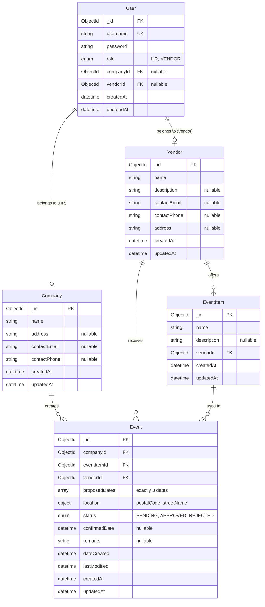

# Entity Relationship Diagram

```mermaid
erDiagram
    User ||--o| Company : "belongs to (HR)"
    User ||--o| Vendor : "belongs to (Vendor)"
    Company ||--o{ Event : "creates"
    Vendor ||--o{ Event : "receives"
    Vendor ||--o{ EventItem : "offers"
    EventItem ||--o{ Event : "used in"

    User {
        ObjectId _id PK
        string username UK
        string password
        enum role "HR, VENDOR"
        ObjectId companyId FK "nullable"
        ObjectId vendorId FK "nullable"
        datetime createdAt
        datetime updatedAt
    }

    Company {
        ObjectId _id PK
        string name
        string address "nullable"
        string contactEmail "nullable"
        string contactPhone "nullable"
        datetime createdAt
        datetime updatedAt
    }

    Vendor {
        ObjectId _id PK
        string name
        string description "nullable"
        string contactEmail "nullable"
        string contactPhone "nullable"
        string address "nullable"
        datetime createdAt
        datetime updatedAt
    }

    EventItem {
        ObjectId _id PK
        string name
        string description "nullable"
        ObjectId vendorId FK
        datetime createdAt
        datetime updatedAt
    }

    Event {
        ObjectId _id PK
        ObjectId companyId FK
        ObjectId eventItemId FK
        ObjectId vendorId FK
        array proposedDates "exactly 3 dates"
        object location "postalCode, streetName"
        enum status "PENDING, APPROVED, REJECTED"
        datetime confirmedDate "nullable"
        string remarks "nullable"
        datetime dateCreated
        datetime lastModified
        datetime createdAt
        datetime updatedAt
    }
```

